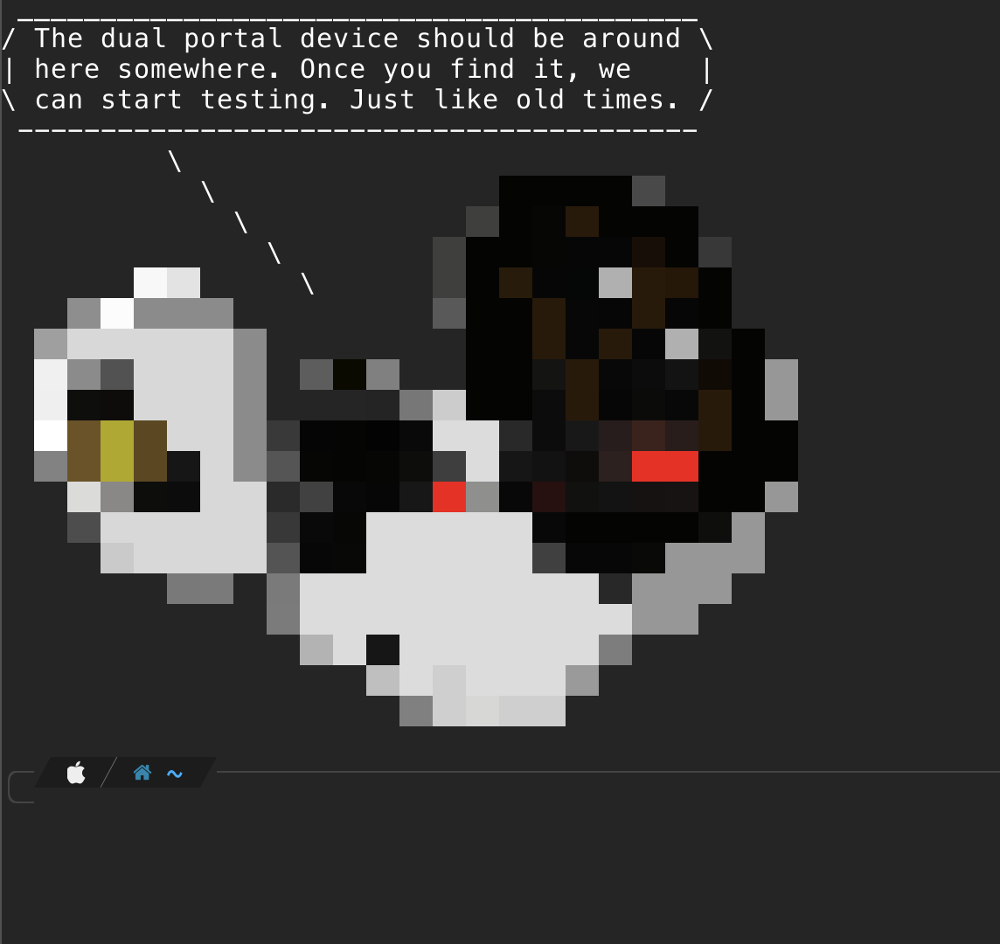
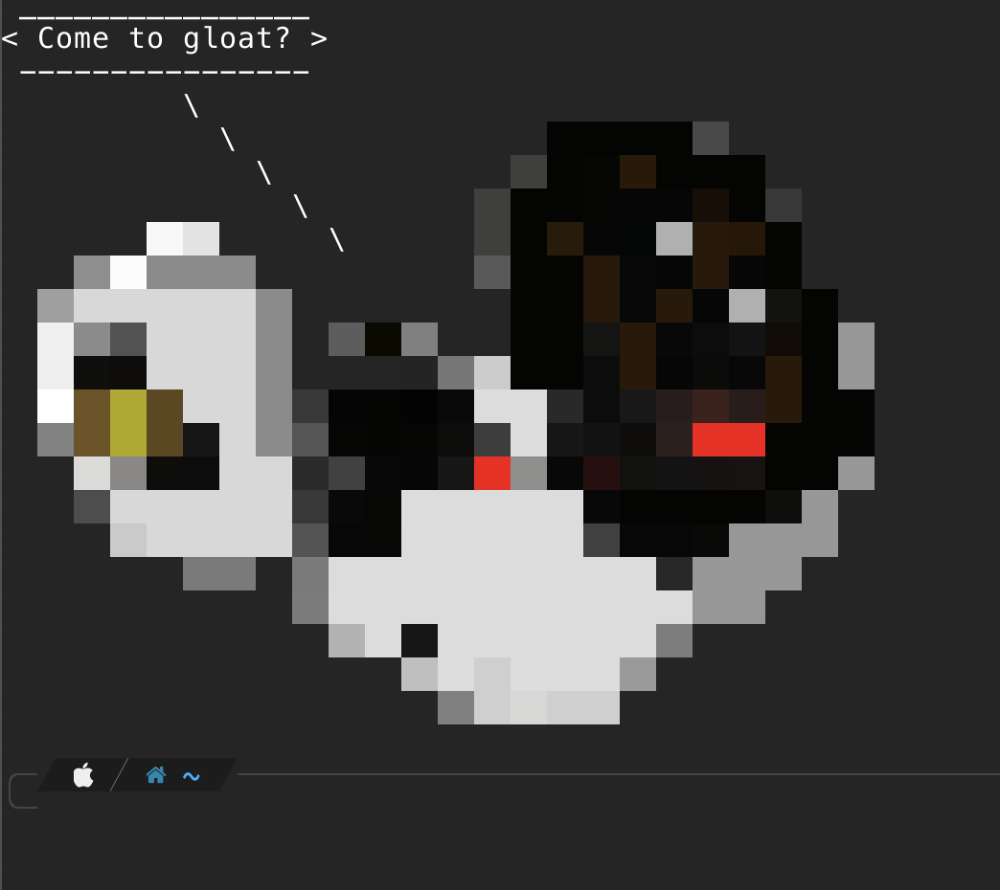

# GLaDOS Said

## Description

GLaDOS said is a CLI tool that will return a randomly generated quote said by GLaDOS in the video game Portal (AND Portal 2).

### Use Case

You can use GLaDOS said in combination with Cowsay to get some interesting results. Simply adding the line `glados-said | cowsay` to your `~/.zshrc` file (or whatever shell you're using) will a new quote every time you open your terminal.



---



(Scaled up GLaDOS Cow file was used).


### Cowfile

To use the pixel art cowfile made by me, you can find it in the assets directory.

---

# Installation

## Using NPM

To install this tool with `NPM` run:

```sh
npm install -g glados-said
```

## Manual Installation

To Install this tool:

```sh
git clone https://github.com/GreysonStalcup/glados-said.git
```

Once cloned, change directories into the correct directory.

```sh
cd glados-said
```

Once the repo is cloned, run the following command to install it _globally_.

```sh
npm install -g
```

# Usage

Using this tool is pretty straight forward. After installed globally, simply run the command `glados-said`. For added fun, you can pass that to [cowsay](https://en.wikipedia.org/wiki/Cowsay). Additionally, you can add a GLaDOS cowfile to your cowfiles directory to have GLaDOS say the quotes!

- [GLaDOS Cowfile](https://github.com/paulkaefer/cowsay-files/blob/main/examples.md#glados-colorcow)

# TODOS

- [x] Scrape quotes from GLaDOS quotes page.
- [ ] Remove duplicate quotes
- [ ] Take out useless quotes (i.e., "yeah.")
